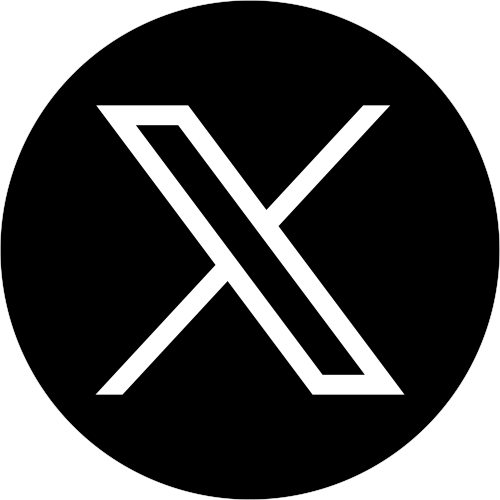
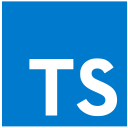

### Hi there 👋

  &nbsp;
  &nbsp;
  

---

## About me

I'm a self-taught front-end developer, from Algeria.

### My skills

  
  
  
  
  
  
  
  

 

- 🌱 Currently learning [React.js](https://react.dev/) and [Node.js](https://nodejs.org/en/learn)
- 💥 Interested in [Flutter]()

<!--
**red1code/red1code** is a ✨ _special_ ✨ repository because its `README.md` (this file) appears on your GitHub profile.

Here are some ideas to get you started:

- 🔭 I’m currently working on ...
- 🌱 I’m currently learning ...
- 👯 I’m looking to collaborate on ...
- 🤔 I’m looking for help with ...
- 💬 Ask me about ...
- 📫 How to reach me: ...
- 😄 Pronouns: ...
- ⚡ Fun fact: ...
-->
